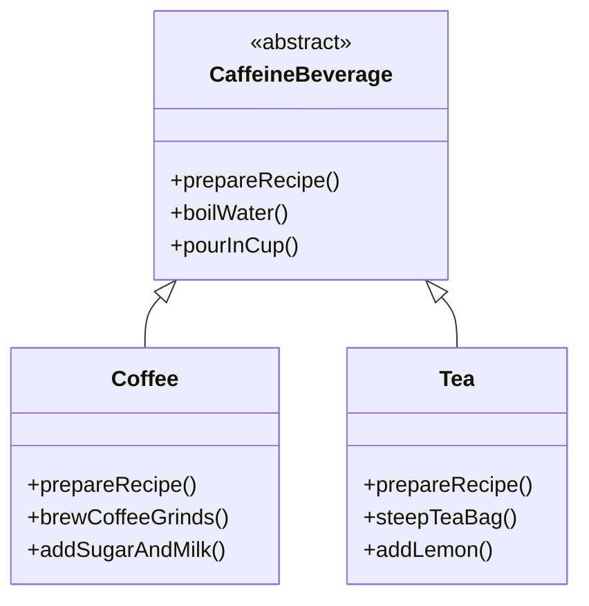
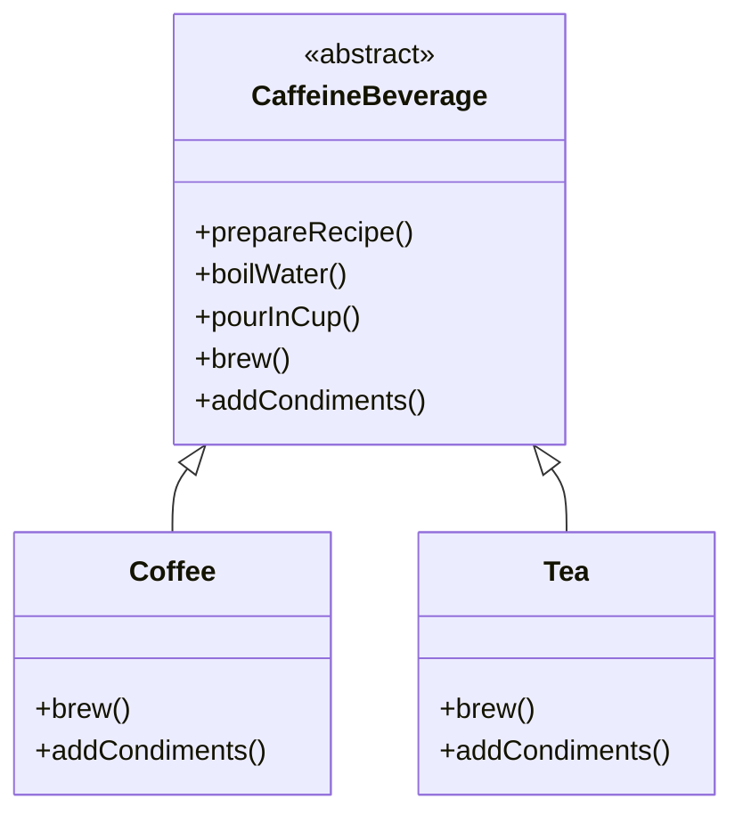

## 템플릿 메소드 패턴 (Template Method Pattern)

템플릿 메소드 패턴은 객체지향 디자인 패턴 중 하나로, 특정 작업의 **알고리즘 골격(template)** 을 상위 클래스에 정의하고, 하위 클래스에서 그 알고리즘의 특정 단계들을 구현하도록 하는 패턴입니다. 알고리즘의 구조는 그대로 유지하면서 알고리즘의 특정 단계를 서브클래스에서 재정의할 수 있습니다.

### 🔑 주요 특징

  * **알고리즘의 불변 부분**: 상위 클래스에 공통적인 로직을 정의합니다. (예: boilWater(), pourInCup())
  * **알고리즘의 가변 부분**: 하위 클래스에 따라 다르게 구현되는 부분을 추상 메소드로 정의하거나 기본 구현을 제공합니다. (예: brew(), addCondiments())
  * **템플릿 메소드**: 공통 로직과 가변 부분을 호출하여 전체 알고리즘의 흐름을 제어하는 최종 메소드입니다. 이 메소드는 일반적으로 하위 클래스에서 오버라이드할 수 없게 설계됩니다. (예: prepareRecipe())

-----

### 패턴 적용 과정 및 예시 코드(python)

템플릿 메소드 패턴은 코드 중복을 제거하고 제어권을 상위 클래스에 넘기며 발전합니다.
커피와 홍차를 만드는 과정은 아래 표와 같이 2번과 4번을 제외하면 공통된 과정을 거치는 것을 알 수 있습니다. 
두 행위는 거의 같은 로직을 가지고 있습니다. 
이 로직들의 공통된 부분을 추상화하고 클래스로 묶어 골격을 만듦니다.

| no | 커피 | 홍차 |
|:---|:---|:---|
| 1 | 물을 끓입니다. | 물을 끓입니다. |
| 2 | 끓는 물에 커피를 우려냅니다. | 끓는 물에 찻잎을 우립니다. |
| 3 | 우린 물을 컵에 따릅니다. | 우린 물을 컵에 따릅니다. |
| 4 | 설탕과 우유 등을 추가할 수 있습니다. | 설탕과 우유, 레몬 등을 추가할 수 있습니다. |

### 1단계: 초기 상태 (부분 추상화)

이 단계는 **코드 중복**을 인식하고 일부 공통 로직만 슈퍼클래스로 옮겼지만, **`prepareRecipe()` 메소드가 여전히 하위 클래스에 남아있는 상태**입니다.

#### 클래스 다이어그램 (적용 전 : 공통 로직 추출 (부분 추상화))


-----
### 파이썬 예시 코드 (적용 전 : 공통 로직 추출 (부분 추상화))
파이썬에서는 추상 클래스를 만들기 위해 `abc` 모듈의 `ABC`와 `abstractmethod`를 사용합니다.

```python
from abc import ABC, abstractmethod

# 슈퍼클래스: 공통된 단계만 가짐
class CaffeineBeverage(ABC):
    def boil_water(self):
        print("1. 물을 끓입니다.")
    
    def pour_in_cup(self):
        print("3. 우린 물을 컵에 따릅니다.")

    @abstractmethod
    def prepare_recipe(self):
        pass

# 서브클래스: prepare_recipe()가 여전히 전체 로직을 제어함
# 홍차 클래스 (적용 전)
class Tea(CaffeineBeverage):
    def prepare_recipe(self):
        self.boil_water()  # 상위 클래스 메소드 호출
        self.steep_tea_bag()
        self.pour_in_cup()  # 상위 클래스 메소드 호출
        self.add_lemon()
        
    def steep_tea_bag(self):
        print("2. 끓는 물에 찻잎을 우립니다.")
        
    def add_lemon(self):
        print("4. 레몬을 추가합니다.")

# 커피 클래스 (적용 전)
class Coffee(CaffeineBeverage):
    def prepare_recipe(self):
        self.boil_water()
        self.brew_coffee_grinds()
        self.pour_in_cup()
        self.add_sugar_and_milk()
        
    def brew_coffee_grinds(self):
        print("2. 끓는 물에 커피를 우려냅니다.")

    def add_sugar_and_milk(self):
        print("4. 설탕과 우유 등을 추가합니다.")
# 실행
tea = Tea()
tea.prepare_recipe()

coffee = Coffee()
coffee.prepare_recipe()
```

-----
### 2단계: 템플릿 메소드 완성 (완벽한 패턴 구현)

**`prepareRecipe()`를 슈퍼클래스로 옮겨** 알고리즘의 흐름을 완전히 고정하고, 가변적인 부분을 **`brew()`와 `addCondiments()`라는 추상 메소드로 통합**합니다.

#### 클래스 다이어그램 (적용 후)



-----

### 파이썬 예시 코드 (적용 후)

```python
from abc import ABC, abstractmethod

# 추상 클래스 (슈퍼클래스)
class CaffeineBeverage(ABC):
    """
    카페인 음료를 만드는 템플릿 메소드를 가진 추상 클래스입니다.
    """
    def prepare_recipe(self):
        """
        템플릿 메소드: 전체 알고리즘의 골격을 정의합니다.
        """
        self.boil_water()
        self.brew()
        self.pour_in_cup()
        # 후크(hook) 메소드를 호출합니다.
        if self.customer_wants_condiments():
            self.add_condiments()
    
    def boil_water(self):
        print("1. 물을 끓입니다.")
    
    def pour_in_cup(self):
        print("3. 우린 물을 컵에 따릅니다.")
    
    # 추상 메소드
    @abstractmethod
    def brew(self):
        """
        하위 클래스에서 반드시 구현해야 하는 메소드입니다.
        """
        pass
    
    # 추상 메소드
    @abstractmethod
    def add_condiments(self):
        """
        하위 클래스에서 반드시 구현해야 하는 메소드입니다.
        """
        pass
        
    # 후크(hook) 메소드: 기본 구현을 제공합니다.
    def customer_wants_condiments(self):
        return True

# 서브클래스: 커피
class Coffee(CaffeineBeverage):
    def brew(self):
        print("2. 끓는 물에 커피를 우려냅니다.")
        
    def add_condiments(self):
        print("4. 설탕과 우유 등을 추가합니다.")
        
# 서브클래스: 홍차
class Tea(CaffeineBeverage):
    def brew(self):
        print("2. 끓는 물에 찻잎을 우립니다.")
        
    def add_condiments(self):
        print("4. 설탕과 우유, 레몬 등을 추가합니다.")
        
    # 후크(hook) 메소드를 오버라이드합니다.
    def customer_wants_condiments(self):
        response = input("음료에 첨가물을 넣으시겠어요? (y/n) ").lower()
        return response.startswith('y')

# 실행
print("--- 커피 제조 ---")
coffee = Coffee()
coffee.prepare_recipe()

print("\n--- 홍차 제조 ---")
tea = Tea()
tea.prepare_recipe()
```

-----

### 후크(Hook) 메소드

**후크(Hook)** 는 추상 클래스에 선언되며, 기본 구현(종종 비어 있는)을 가진 메소드입니다. 후크는 하위 클래스가 알고리즘의 특정 단계를 선택적으로 오버라이드할 수 있도록 합니다.

후크의 용도는 다음과 같습니다.

1.  **선택적 구현**: 알고리즘에서 필수적이지 않은 부분을 하위 클래스에서 구현하도록 할 때 사용합니다.
2.  **알고리즘의 제어**: 하위 클래스가 템플릿 메소드의 특정 시점에 반응하거나, 알고리즘의 진행 여부를 결정하게 하는 기능을 제공합니다.
3.  **예측 불가능한 변화에 대한 대응**: `customer_wants_condiments()` 예시처럼, 고객의 선택에 따라 첨가물 추가 로직을 실행할지 말지 결정하는 데 사용됩니다.

네, 요청하신 내용을 정리해 드리겠습니다. 할리우드 원칙에 대한 설명과 템플릿 메소드 패턴과의 관계, 그리고 사용된 용어들에 대한 정리를 제공합니다.

---

## 💡 디자인 원칙 및 패턴 비교

### 1\. 할리우드 원칙 (Hollywood Principle)
<details><summary> ></summary>
"Don't Call Us, We'll Call You" (저희에게 전화하지 마세요, 저희가 연락드리겠습니다)라는 문장에서 유래한 디자인 원칙입니다. 이는 **저수준(low-level) 구성 요소**가 **고수준(high-level) 구성 요소**를 직접 호출해서는 안 되며, 반대로 고수준 구성 요소가 저수준 구성 요소를 호출하여 시스템의 제어 흐름을 주도해야 한다는 원칙입니다.
이 원칙은 **의존성 역전 원칙(Dependency Inversion Principle)**과도 관련이 깊습니다. 일반적으로 저수준 모듈(구체 클래스)이 고수준 모듈(추상 클래스)에 의존하게 되는데, 이 원칙을 따르면 의존성의 방향이 역전됩니다. 즉, 구체적인 구현(저수준)이 추상화된 인터페이스(고수준)에 의존하게 되며, 시스템의 결합도를 낮추고 유연성을 높일 수 있습니다.</details>

  * **원칙**: "저희에게 전화하지 마세요, 저희가 연락드리겠습니다 (Don't Call Us, We'll Call You)."
  * **관계**: 템플릿 메소드 패턴은 이 원칙을 구현합니다. \*\*슈퍼클래스(고수준)\*\*가 `prepareRecipe()`를 통해 **제어권**을 가지며, 필요한 시점에 \*\*서브클래스(저수준)\*\*에 구현된 `brew()`나 `addCondiments()`를 호출합니다. 서브클래스는 직접 슈퍼클래스를 호출하며 알고리즘을 제어하지 않습니다.

**템플릿 메소드 패턴**은 이 할리우드 원칙을 잘 구현한 대표적인 예시입니다.
* **고수준 구성 요소**: `CaffeineBeverage`와 같은 **추상 클래스**입니다. 이 클래스는 `prepareRecipe()`라는 템플릿 메소드를 통해 전체 알고리즘의 제어 흐름을 가지고 있습니다.
* **저수준 구성 요소**: `Coffee`나 `Tea`와 같은 **구체적인 서브클래스**입니다. 이들은 `brew()`나 `addCondiments()`와 같은 메소드들을 구현합니다.

* 템플릿 메소드 패턴에서는 서브클래스가 직접 슈퍼클래스의 메소드를 호출하여 알고리즘을 제어하지 않습니다. 대신, 슈퍼클래스(고수준)의 템플릿 메소드가 **필요할 때** 서브클래스(저수준)에 구현된 메소드를 호출합니다. 
이처럼 제어권이 서브클래스가 아닌 슈퍼클래스에 있다는 점에서 템플릿 메소드 패턴은 할리우드 원칙을 잘 따르고 있습니다.
---
### 2\. 전략 패턴 (Strategy Pattern)과의 비교
템플릿 메소드 패턴과 전략 패턴은 모두 알고리즘을 캡슐화하고 재사용하는 데 사용되지만, 제어 흐름의 주체와 유연성에서 큰 차이를 보입니다.

| 구분 | 템플릿 메소드 패턴 | 전략 패턴 |
|:---|:---|:---|
| **목적** | 알고리즘의 **구조를 고정**하고, 일부 단계를 하위 클래스에 위임하여 재정의합니다. | 알고리즘 **전체**를 캡슐화하고, 런타임에 동적으로 교체 가능하게 합니다. |
| **핵심 기술** | **상속(Inheritance)**을 사용하여 부모 클래스와 자식 클래스 간의 관계를 형성합니다. | **위임(Composition)**을 사용하여 한 객체가 다른 객체의 기능을 사용합니다. |
| **제어 흐름의 주체** | **슈퍼클래스**입니다. 슈퍼클래스의 템플릿 메소드가 전체 흐름을 결정합니다. | **클라이언트**입니다. 클라이언트가 상황에 맞는 전략 객체를 선택하고 실행합니다. |
| **유연성** | 낮습니다. 알고리즘의 구조가 고정되어 있어 변경이 어렵습니다. | 매우 높습니다. 런타임에 알고리즘을 쉽게 교체할 수 있습니다. |
| **예시** | **음료 제조 과정**처럼, 순서가 정해진 공통된 절차가 필요한 경우입니다. | **결제 방식**처럼, 상황에 따라 알고리즘(신용카드, 계좌이체 등)을 바꿔야 하는 경우입니다. |
| **특징** | **"Don't Call Us, We'll Call You"**라는 할리우드 원칙을 따릅니다. | 클라이언트와 알고리즘 객체 간의 **의존성이 낮고** 독립적입니다. |
| **단점** | 상속을 사용하므로 **유연성이 떨어지고**, 단일 상속 제약이 있을 수 있습니다. | 각 알고리즘마다 클래스를 만들어야 하므로 **클래스 수가 증가**할 수 있습니다. |
---
### 용어 정리

<details><summary>디자인 패턴 (Design Pattern):</summary>소프트웨어 설계 시 자주 발생하는 문제에 대한 일반적이고 재사용 가능한 해결책입니다. 코드가 아닌, 특정 상황에서 구조화된 해결책의 청사진을 의미합니다.</details>

<details><summary>템플릿 메소드 (Template Method):</summary>상위 클래스에 정의된 메소드로, 알고리즘의 전체적인 골격을 정의합니다. 보통 여러 단계의 메소드들을 순서대로 호출하는 역할을 합니다.</details>

<details><summary>추상 클래스 (Abstract Class):</summary>하나 이상의 추상 메소드를 포함하는 클래스입니다. 직접 객체를 생성할 수 없으며, 반드시 상속받아 추상 메소드를 구현해야 합니다.</details>

<details><summary>슈퍼클래스 (Superclass):</summary>상속 관계에서 상위에 위치하는 클래스로, 부모 클래스라고도 합니다. 공통된 속성과 메소드를 하위 클래스에 물려줍니다.</details>

<details><summary>서브클래스 (Subclass):</summary>상속 관계에서 하위에 위치하는 클래스로, 자식 클래스라고도 합니다. 슈퍼클래스의 속성과 메소드를 상속받고, 필요에 따라 확장하거나 재정의합니다.</details>

<details><summary>추상 메소드 (Abstract Method):</summary>선언만 있고 구현은 없는 메소드입니다. 이 메소드를 포함하는 클래스는 추상 클래스가 되며, 하위 클래스에서 반드시 구현해야 합니다.</details>

<details><summary>후크 메소드 (Hook Method):</summary>템플릿 메소드 패턴에서 선택적으로 오버라이드할 수 있는 메소드입니다. 기본 구현이 비어 있거나 간단한 형태로 제공되어 하위 클래스가 필요에 따라 기능을 추가하거나 변경할 수 있는 '연결 고리' 역할을 합니다.</details>

<details><summary>캡슐화 (Encapsulation):</summary>객체의 상태(데이터)와 행위(메소드)를 하나로 묶고, 외부에서 직접 접근하지 못하도록 보호하는 객체지향의 원칙입니다.</details>

<details><summary>상속 (Inheritance):</summary>한 클래스가 다른 클래스의 속성과 기능을 물려받는 것입니다. 코드 재사용성을 높이고 계층적인 관계를 형성합니다.</details>

<details><summary>다형성 (Polymorphism):</summary>하나의 객체가 여러 형태를 가질 수 있는 객체지향의 특징입니다. 동일한 메소드 호출이 객체의 타입에 따라 다르게 동작할 수 있습니다. 템플릿 메소드 패턴은 추상 메소드를 통해 이 다형성을 적극적으로 활용합니다.</details>

#### 느낀점: 
아직 그 디자인 패턴이 저 디자인 패턴으로 보입니다. 그래도 두루뭉실하던 추상화의 개념을 확실하게 알게된것 같습니다.
