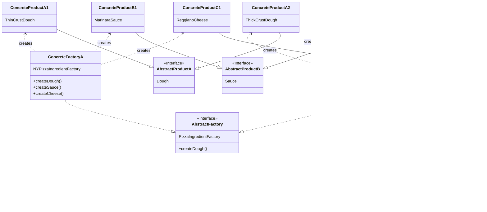

## 추상 팩토리 패턴 (Abstract Factory Pattern) 🏭

**추상 팩토리 패턴**은 **서로 관련이 있거나 의존하는 객체들의 '군(Family)'을 생성**하기 위한 인터페이스를 제공하는 패턴입니다. 이 패턴을 사용하면, 구체적인 클래스를 지정하지 않고도 관련 객체들을 한번에 생성할 수 있습니다.

팩토리 메소드 패턴이 **어떤 '객체'를 생성할지**를 서브클래스에게 위임했다면, 추상 팩토리 패턴은 거기서 **어떤 '객체들의 집합'을 생성할지**를 구체적인 팩토리 클래스에게 위임합니다.

예를 들어, 컴퓨터를 조립할 때 'AMD'이라는 공장(Factory)에 부품을 주문하면 CPU, RAM, GPU가 모두 AMD 제품군으로 통일되어 완벽한 호환성을 보장합니다.<br/>
'Samsung' 공장에 주문하면 모든 부품이 Samsung 제품군으로 제공됩니다.<br/>
여기서 '부품 공장'이 **추상 팩토리**이고, 'AMD 공장', 'Samsung 공장'이 **구상 팩토리**이며, 'CPU', 'RAM' 등이 **추상 제품**에 해당합니다.

### **사용을 고려해볼 경우 🤔**

  * 시스템이 생성하는 제품(객체)들의 구성이나 표현 방식과 독립적으로 운영되어야 할 때.
  * 서로 관련 있는 여러 종류의 객체로 시스템을 구성해야 하고, 이들을 함께 사용해야 할 때 (예: 특정 테마의 UI 컴포넌트들 - 버튼, 텍스트박스, 체크박스 등).
  * 제품군의 구현은 숨기고 인터페이스만 노출하여 라이브러리를 제공하고 싶을 때.

-----

### **용어 설명** 
* 용어 설명 readme 생성 필요

<details><summary>추상 팩토리 (Abstract Factory)</summary>
관련된 제품군을 생성하기 위한 인터페이스를 정의합니다. 예를 들어, `PizzaIngredientFactory`(피자재료공장)는 `createDough()`, `createSauce()`, `createCheese()` 와 같은 메소드를 선언합니다.
</details>

<details><summary>구상 팩토리 (Concrete Factory)</summary>
추상 팩토리의 인터페이스를 실제로 구현하는 클래스입니다. 특정 '테마'나 '스타일'에 맞는 제품군을 생성하는 책임을 가집니다. 예를 들어, `NYPizzaIngredientFactory`는 뉴욕 스타일에 맞는 도우, 소스, 치즈를 생성합니다.
</details>

<details><summary>추상 제품 (Abstract Product)</summary>
제품군에 속하는 개별 객체의 공통 인터페이스를 정의합니다. 피자 예제에서는 `Dough`, `Sauce`, `Cheese` 인터페이스가 여기에 해당합니다.
</details>

<details><summary>구상 제품 (Concrete Product)</summary>
추상 제품의 인터페이스를 실제로 구현한 클래스입니다. 구상 팩토리에 의해 생성됩니다. 예를 들어, `ThinCrustDough` (씬 크러스트 도우), `MarinaraSauce` (마리나라 소스) 등이 있습니다.
</details>

<details><summary>클라이언트 (Client)</summary>
추상 팩토리와 추상 제품의 인터페이스만을 사용하여 객체를 생성하고 사용합니다. 따라서 어떤 구상 팩토리가 사용되는지에 따라 전체 제품군이 쉽게 교체될 수 있습니다.
</details>

-----

### **다른 팩토리 패턴과의 비교**

| 구분 | **간단한 팩토리 (Simple Factory)** | **팩토리 메소드 (Factory Method)** | **추상 팩토리 (Abstract Factory)** |
| :--- | :--- | :--- | :--- |
| **목적** | 객체 생성 로직의 캡슐화 | 서브클래스가 생성할 객체 결정 | **관련 객체군의 생성** |
| **단위** | 단일 객체 생성 | 단일 객체 생성 | **객체들의 '군(Family)' 생성** |
| **구현 방식** | 특정 클래스가 조건문으로 객체 생성 | **상속**을 통해 서브클래스가 메소드 오버라이드 | \*\*합성(Composition)\*\*을 통해 객체 생성 |
| **핵심** | `if/else`를 한 곳에 모음 | `Creator` 클래스와 `Product` 클래스를 분리 | `Factory` 인터페이스와 `Product` 인터페이스를 분리 |

-----

### **피자 가게 예제: 원재료군(Family) 공급받기**

이전 팩토리 메소드 패턴에서는 `NYPizzaStore`가 `NYStyleCheesePizza`를 직접 생성했습니다. 하지만 여기서 문제가 발생합니다. 뉴욕 스타일 피자는 '씬 크러스트 도우'와 '레지아노 치즈'를 사용하고, 시카고 스타일 피자는 '딥 디쉬 도우'와 '모짜렐라 치즈'를 사용해야 한다면 어떨까요?

`NYStyleCheesePizza` 클래스 내부에서 `new ThinCrustDough()`와 같이 재료를 하드코딩하면, 재료가 바뀔 때마다 피자 클래스를 수정해야 합니다. 이는 \*\*개방-폐쇄 원칙(OCP)\*\*에 위배됩니다.

**해결책**: 지역별로 '피자 재료 공장(Ingredient Factory)'을 만들고, 피자는 이 공장에서 제공하는 재료를 사용하도록 하는 것입니다. 이것이 바로 추상 팩토리 패턴의 역할입니다.

#### **Mermaid 클래스 다이어그램**



#### **Python 코드 예제**

```python
from abc import ABC, abstractmethod

# --- 1. 추상 제품 (Abstract Products): 제품군의 각 부품 인터페이스(공장) ---
class Dough(ABC): pass
class Sauce(ABC): pass
class Cheese(ABC): pass

# --- 2. 구상 제품 (Concrete Products): 스타일별 실제 재료들(재료) ---
# 뉴욕 스타일 재료군
class ThinCrustDough(Dough):
    def __str__(self): return "씬 크러스트 도우"
class MarinaraSauce(Sauce):
    def __str__(self): return "마리나라 소스"
class ReggianoCheese(Cheese):
    def __str__(self): return "레지아노 치즈"

# 시카고 스타일 재료군
class ThickCrustDough(Dough):
    def __str__(self): return "딥 디쉬 도우"
class PlumTomatoSauce(Sauce):
    def __str__(self): return "플럼 토마토 소스"
class MozzarellaCheese(Cheese):
    def __str__(self): return "모짜렐라 치즈"

# --- 3. 추상 팩토리 (Abstract Factory): 재료군 생성 인터페이스 ---
class PizzaIngredientFactory(ABC):
    # Dough 타입의 객체를 반환해야 하는 create_dough라는 메소드를 추상 팩토리 정의
    @abstractmethod
    def create_dough(self) -> Dough: pass
    @abstractmethod
    def create_sauce(self) -> Sauce: pass
    @abstractmethod
    def create_cheese(self) -> Cheese: pass

# --- 4. 구상 팩토리 (Concrete Factories): 스타일별 재료 공장 ---
class NYPizzaIngredientFactory(PizzaIngredientFactory):
    """뉴욕 스타일 재료군을 생성하는 공장"""
    # ThinCrustDough 클래스의 실제 객체(인스턴스)를 생성하여 반환하는 create_dough 메소드를 정의
    def create_dough(self) -> Dough: return ThinCrustDough()
    def create_sauce(self) -> Sauce: return MarinaraSauce()
    def create_cheese(self) -> Cheese: return ReggianoCheese()

class ChicagoPizzaIngredientFactory(PizzaIngredientFactory):
    """시카고 스타일 재료군을 생성하는 공장"""
    def create_dough(self) -> Dough: return ThickCrustDough()
    def create_sauce(self) -> Sauce: return PlumTomatoSauce()
    def create_cheese(self) -> Cheese: return MozzarellaCheese()

# --- 5. 클라이언트 코드 리팩토링 ---
# 이제 Pizza 클래스는 재료 공장을 통해 재료를 공급받을 수 있다.
class Pizza(ABC):
    name: str
    dough: Dough
    sauce: Sauce
    cheese: Cheese

    @abstractmethod
    def prepare(self):
        """재료를 준비하는 메소드. 이 메소드에서 팩토리를 사용함."""
        pass

    def bake(self): print("175도에서 25분 간 굽기")
    def cut(self): print("피자를 사선으로 자르기")
    def box(self): print("상자에 피자 담기")

class CheesePizza(Pizza):
    def __init__(self, ingredient_factory: PizzaIngredientFactory):
        self.ingredient_factory = ingredient_factory

    def prepare(self):
        print(f"--- {self.name} 준비 중 ---")
        # 구체적인 재료 클래스를 알지 않아도 공장을 통해 추상적인 재료를 받아 올 수 있다.
        self.dough = self.ingredient_factory.create_dough()
        self.sauce = self.ingredient_factory.create_sauce()
        self.cheese = self.ingredient_factory.create_cheese()
        print(f"재료: {self.dough}, {self.sauce}, {self.cheese}")

# 모든 피자 가게가 따라야 할 공통적인 절차와 규칙을 정의하는 '본사 지침서' << 각 지점에 상속.
class PizzaStore(ABC):
    def order_pizza(self, pizza_type: str) -> Pizza:
        pizza = self.create_pizza(pizza_type)
        print(f"\n--- {pizza.name} 주문 처리 시작 ---")
        pizza.prepare()
        pizza.bake()
        pizza.cut()
        pizza.box()
        return pizza

    # 어떤 구체적인 객체(피자)를 만들 것인가"에 대한 책임을 서브클래스(지역 피자 가게)에게 위임
    @abstractmethod
    def create_pizza(self, pizza_type: str) -> Pizza:
        pass

class NYPizzaStore(PizzaStore):
    def create_pizza(self, pizza_type: str) -> Pizza:
        pizza = None
        # 뉴욕 지점은 뉴욕 재료 공장을 사용
        ingredient_factory = NYPizzaIngredientFactory()

        if pizza_type == "cheese":
            pizza = CheesePizza(ingredient_factory)
            pizza.name = "뉴욕 스타일 치즈 피자"
        # ... 다른 피자 종류 (clam, veggie 등) 추가 가능
        return pizza

class ChicagoPizzaStore(PizzaStore):
    def create_pizza(self, pizza_type: str) -> Pizza:
        pizza = None
        # 시카고 지점은 시카고 재료 공장을 사용
        ingredient_factory = ChicagoPizzaIngredientFactory()

        if pizza_type == "cheese":
            pizza = CheesePizza(ingredient_factory)
            pizza.name = "시카고 스타일 치즈 피자"
        return pizza


# --- 실행 코드 ---
ny_store = NYPizzaStore()
ny_store.order_pizza("cheese")

chicago_store = ChicagoPizzaStore()
chicago_store.order_pizza("cheese")
```

### **장점과 단점**

#### **장점 👍**

  * **제품군 간의 일관성 보장**: 구상 팩토리는 특정 테마의 제품들만 생성하므로, 서로 호환되지 않는 제품이 섞일 가능성이 없습니다. (뉴욕 피자에 시카고 도우가 들어가는 일이 없음)
  * **느슨한 결합 (Loose Coupling)**: 클라이언트(`Pizza` 클래스)는 구체적인 제품 클래스(`ThinCrustDough`)가 아닌 추상 인터페이스(`Dough`)에만 의존하므로, 제품 구현이 변경되어도 클라이언트 코드는 영향을 받지 않습니다.
  * **개방-폐쇄 원칙 (OCP) 만족**: '이탈리아 스타일' 같은 새로운 제품군을 추가할 때, 기존 팩토리 코드를 수정할 필요 없이 새로운 구상 팩토리 클래스(`ItalianPizzaIngredientFactory`)와 구상 제품 클래스들만 추가하면 됩니다.

#### **단점 👎**

  * **복잡성 증가**: 패턴을 구성하는 클래스와 인터페이스가 많아져 초기 구현이 복잡할 수 있습니다.
  * **제품 종류 추가의 어려움**: 제품군에 새로운 종류의 제품(예: `Topping`)을 추가하려면, `AbstractFactory` 인터페이스 자체(`PizzaIngredientFactory`)를 수정해야 합니다. 이는 모든 하위 구상 팩토리 클래스에 영향을 미치는 큰 변경입니다.

-----

### **예제 코드: 컴퓨터 부품 조립 (하드웨어 제품군 통일) 🖥️**

이 예제는 위에서 예시를 들었던 특정 벤더(AMD, Samsung, Apple)의 제품군으로 컴퓨터 부품(CPU, RAM, GPU)을 일관되게 사용한 예시의 코드입니다.

```python
from abc import ABC, abstractmethod

# =================================================================
# 1. 추상 제품 (Abstract Products): 제품군에 속하는 개별 객체의 인터페이스
# =================================================================
class CPU(ABC):
    """CPU 인터페이스"""
    @abstractmethod
    def get_info(self): pass

class RAM(ABC):
    """RAM 인터페이스"""
    @abstractmethod
    def get_info(self): pass

class GPU(ABC):
    """GPU 인터페이스"""
    @abstractmethod
    def get_info(self): pass

# =================================================================
# 2. 구상 제품 (Concrete Products): 특정 벤더의 실제 부품 구현
# =================================================================

# AMD 제품군
class AMDCpu(CPU):
    def get_info(self): return "AMD Ryzen CPU"
class AMDRam(RAM):
    def get_info(self): return "AMD Radeon RAM"
class AMDGpu(GPU):
    def get_info(self): return "AMD Radeon GPU"

# Samsung 제품군
class SamsungCpu(CPU):
    def get_info(self): return "Samsung Exynos CPU"
class SamsungRam(RAM):
    def get_info(self): return "Samsung DDR5 RAM"
class SamsungGpu(GPU):
    def get_info(self): return "Samsung Custom GPU"

# Apple 제품군
class AppleCpu(CPU):
    def get_info(self): return "Apple M3 Chip"
class AppleRam(RAM):
    def get_info(self): return "Apple Unified Memory"
class AppleGpu(GPU):
    def get_info(self): return "Apple Integrated GPU"

# =================================================================
# 3. 추상 팩토리 (Abstract Factory): 제품군 생성 인터페이스
# =================================================================
class HardwareFactory(ABC):
    """관련된 부품(제품군)을 생성하기 위한 인터페이스"""
    @abstractmethod
    def create_cpu(self) -> CPU: pass
    @abstractmethod
    def create_ram(self) -> RAM: pass
    @abstractmethod
    def create_gpu(self) -> GPU: pass

# =================================================================
# 4. 구상 팩토리 (Concrete Factories): 특정 벤더의 부품 공장
# =================================================================
class AMDFactory(HardwareFactory):
    """AMD 제품군을 생성하는 공장"""
    def create_cpu(self) -> CPU: return AMDCpu()
    def create_ram(self) -> RAM: return AMDRam()
    def create_gpu(self) -> GPU: return AMDGpu()

class SamsungFactory(HardwareFactory):
    """Samsung 제품군을 생성하는 공장"""
    def create_cpu(self) -> CPU: return SamsungCpu()
    def create_ram(self) -> RAM: return SamsungRam()
    def create_gpu(self) -> GPU: return SamsungGpu()

class AppleFactory(HardwareFactory):
    """Apple 제품군을 생성하는 공장"""
    def create_cpu(self) -> CPU: return AppleCpu()
    def create_ram(self) -> RAM: return AppleRam()
    def create_gpu(self) -> GPU: return AppleGpu()

# =================================================================
# 5. 클라이언트 (Client): 팩토리를 사용하여 컴퓨터를 조립
# =================================================================
class ComputerAssembler:
    def __init__(self, factory: HardwareFactory):
        self.factory = factory
        print(f"\n--- {type(factory).__name__.replace('Factory', '')} 제품군으로 조립 시작 ---")
        
    def assemble_computer(self):
        # 클라이언트는 구체적인 제품 클래스(AMDCpu 등)가 아닌, 
        # 추상 인터페이스(CPU)와 추상 팩토리(HardwareFactory)에만 의존한다.
        cpu = self.factory.create_cpu()
        ram = self.factory.create_ram()
        gpu = self.factory.create_gpu()

        print(f"  CPU: {cpu.get_info()}")
        print(f"  RAM: {ram.get_info()}")
        print(f"  GPU: {gpu.get_info()}")
        print("  => 조립 완료: 모든 부품의 호환성이 완벽하게 보장됨.")

# --- 실행 코드 ---
# 1. AMD 컴퓨터 조립
amd_factory = AMDFactory()
amd_assembler = ComputerAssembler(amd_factory)
amd_assembler.assemble_computer()

# 2. Samsung 컴퓨터 조립
samsung_factory = SamsungFactory()
samsung_assembler = ComputerAssembler(samsung_factory)
samsung_assembler.assemble_computer()

# 3. Apple 컴퓨터 조립
apple_factory = AppleFactory()
apple_assembler = ComputerAssembler(apple_factory)
apple_assembler.assemble_computer()
```

-----

### ** 예시코드의 핵심 **
이 패턴을 통해 우리는 '부품을 요청하는 쪽'과 '부품을 실제로 만드는 쪽'을 깔끔하게 분리하여, 코드의 유연성과 안정성을 동시에 확보할 수 있습니다.

1.  **클라이언트의 독립성**: `ComputerAssembler` (클라이언트)는 오직 **`HardwareFactory`** 인터페이스만 알 뿐, 자신이 어떤 구체적인 공장(`AMDFactory`, `SamsungFactory` 등)을 사용하는지, 어떤 구체적인 부품(`AMDCpu`, `SamsungCpu` 등)을 얻는지 알 필요가 없습니다. 이는 **느슨한 결합**을 만듭니다.
2.  **제품군 일관성 보장**: `AMDFactory`는 항상 AMD 제품군에 속하는 \*\*`AMDCpu`, `AMDRam`, `AMDGpu`\*\*만을 생성하도록 구현되어 있습니다. 따라서, 클라이언트가 어떤 공장을 선택하더라도, CPU, RAM, GPU가 서로 다른 벤더의 제품으로 섞이는 일이 없어 **호환성이 완벽하게 보장**됩니다.
3.  **쉬운 확장성 (OCP)**: 만약 인텔(Intel) 부품군을 추가하고 싶다면, 기존의 모든 코드를 수정할 필요 없이 **`IntelCpu`, `IntelRam`, `IntelGpu`** 구상 제품들과 **`IntelFactory`** 구상 팩토리만 새로 추가하면 됩니다. (개방-폐쇄 원칙 만족)

### 느낀점
추상팩토리에 대하여 예시코드를 보면서 이해 할 수 있는 시간이었습니다.
다만 위에서 정리한 내용처럼 직접 적용하기 위한 초기 구현이 복잡할것이 분명하기에 적용하기 두렵습니다.
컴퓨터 부품이나 전체를 교체해야하는 테마변경과같이 재료가 한정적이고 잘 바뀌지 않는 제품군의 경우 이 디자인패턴이 매우 적합할것으로 보입니다.