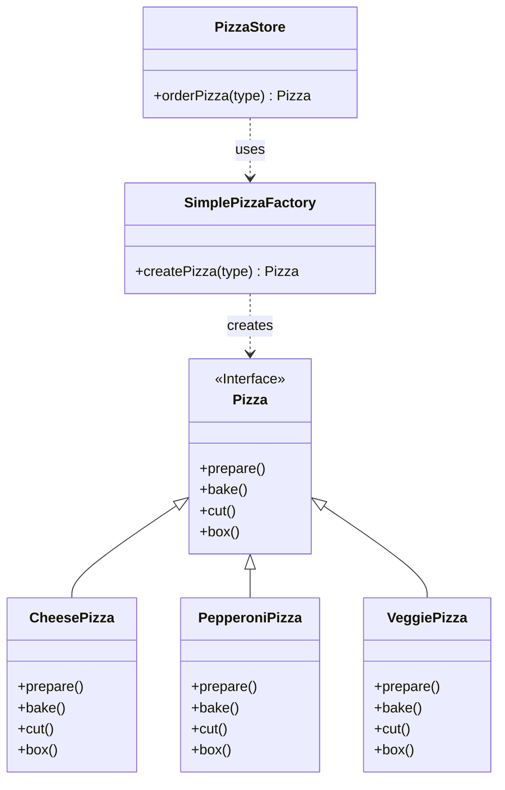
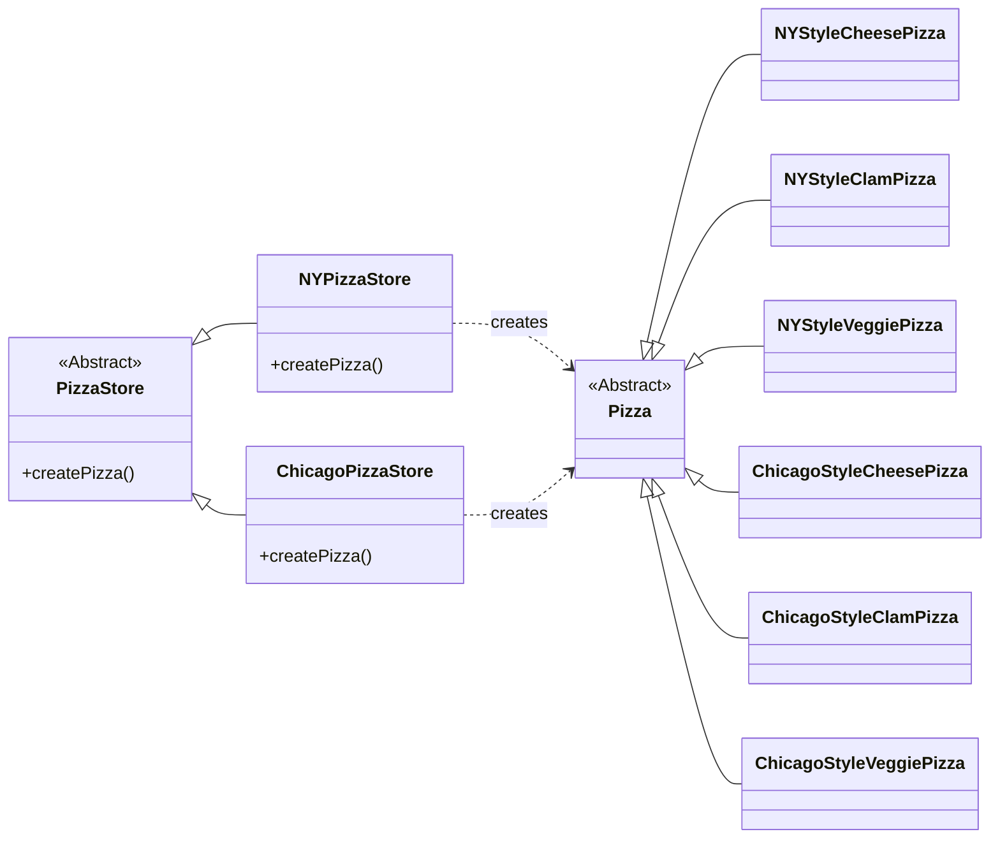

### **용어 설명**

<details><summary>팩토리 패턴 (Factory Pattern) 🏭</summary>
객체 생성을 전문적으로 처리하는 클래스(팩토리)를 만들어 사용하는 디자인 패턴입니다. 클라이언트 코드에서 `new` 키워드를 사용하여 직접 객체를 생성하는 대신, 팩토리 클래스에 원하는 객체의 종류를 알려주면 팩토리가 대신 객체를 생성하여 반환해 줍니다. 이렇게 하면 객체 생성 로직이 한 곳에 캡슐화되어, 새로운 종류의 객체가 추가되거나 변경되어도 클라이언트 코드를 수정할 필요가 없어지므로 코드의 유연성과 유지보수성이 향상됩니다. "객체 생성과 사용을 분리" 하는 것이 핵심입니다.
</details> </br>

<details><summary>추상클래스 (Abstract Class)</summary>
· 추상 클래스(abstract class)는 하나 이상의 추상 메소드(abstract method)를 포함하는 클래스입니다.
<br>
· 추상 메소드는 선언만 있고, 선언부에 ‘abstract’ 라는 키워드를 붙입니다.
<br>
· 추상 메소드가 포함되었다면 클래스도 추상 클래스이므로 클래스명 앞에 ‘abstract’ 키워드를 붙여야 합니다.
<br>
· 추상 클래스는 다른 하위 클래스를 상속하기 위한 용도입니다.
<br>
· 추상 클래스에서 매개변수 생성자 메소드가 필요한 이유는 추상 클래스는 하위 클래스에 상속을 목적으로 만들어진 클래스이기 때문에, 하위 클래스에서 상위 클래스에 만들어둔 매개변수 생성자 메소드를 통하여 인스턴스 변수의 값을 초기화하기 때문입니다.
<br>
· 추상 클래스는 미완성 클래스이기 때문에 인스턴스를 생성할 수 없습니다.
</details> </br>

<details><summary>구상클래스 (Concrete Class)</summary>
· `new` 연산자를 사용하여 인스턴스를 생성할 수 있는 클래스를 Concrete(구상) 클래스라고 합니다.
<br>
· 미완성 클래스인 추상 클래스에 정의된 기능을 구현하는 클래스입니다. (추상과 대조적)
</details> </br>

<details><summary>인터페이스 (Interface)</summary>
· 클래스의 공통된 기능을 정리한 명세서입니다.
<br>
· 모든 기능을 추상화로 정의만 하고 구현은 하지 않은 것입니다.(100% 추상 메소드)
<br>
· 추상 클래스와의 차이점은 추상 클래스는 **IS - A** "\~이다"이고, 인터페이스는 **HAS - A** "\~을 할 수 있는"의 의미를 가지고 있습니다. 이 말이 굉장히 중요한데, 추상 클래스는 클래스이기 때문에 상속을 한 번만 하며, 상속을 통해 서브 클래스에서 구현을 완성하기 위한 클래스이지만, 인터페이스도 구상 클래스를 생성하여 상속을 하는 것까지는 동일하지만 인터페이스의 특성상 다중 상속도 가능하다는 점에서 차이를 보입니다.
</details> </br>

<details><summary>프레임워크 (Framework)</summary>
소프트웨어의 특정 문제를 해결하기 위해 상호 협력하는 클래스와 인터페이스의 집합으로, 완성된 구조를 제공하며 개발자가 그 안에서 필요한 코드를 작성하여 애플리케이션을 완성시키는 방식입니다. 제어의 역전(Inversion of Control)이 적용되어, 개발자가 작성한 코드를 프레임워크가 호출하고 실행 흐름을 주도합니다. 자동차의 뼈대(프레임)에 비유할 수 있으며, 개발자는 엔진, 좌석 등 필요한 부품을 채워 넣는 역할을 합니다.
</details> </br>

<details><summary>캡슐화 (Encapsulation)</summary>
객체의 데이터(속성)와 해당 데이터를 처리하는 함수(메소드)를 하나로 묶고, 데이터에 대한 직접적인 접근을 제한하여 정보 은닉을 구현하는 객체 지향 프로그래밍의 핵심 원칙 중 하나입니다. 팩토리 패턴에서는 변화가 잦은 객체 생성 로직을 별도의 클래스로 묶어 캡슐화함으로써 시스템의 다른 부분에 미치는 영향을 최소화합니다.
</details> </br>

-----
New 연산자를 사용하면 구상 클래스의 인스턴스가 만들어집니다. </br>
구상클래스를 바탕으로 코딩하면 나중에 코드를 수정해야할 가능성이 커지고 유연성이 떨어진다고합니다. </br>
인터페이스를 바탕으로 만들어진 코드는 인터페이스에 맞춰서 코딩하면 시스템에서 일어날 수 있는 여러 변화에 대응할 수 있습니다.  </br>
인터페이스를 바탕으로 만들어진 코드는 어떤 클래스든 특정 인터페이스만 구현하면 사용할 수 있기때문입니다. 이를 다형성이라고합니다.  </br>
반대로 구상클래스를 많이 사용하면 추가유지보수에 용이하지 않기때문에 변경에 닫혀있는 코드라고 부릅니다. </br>
 </br>
아래는 책에서 소개된 피자 주문을 예시로 한 팩토리 패턴 예시입니다. </br>


### **팩토리 패턴 예제: 피자 가게**

#### **Step 1: 문제점 파악 (팩토리 패턴 적용 전)**

```python
# 바뀌는 부분을 찾아서 바뀌지 않는 부분과 분리해야한다.
# 가상의 Pizza 클래스들을 정의합니다.
class Pizza:
    def prepare(self): print(f"{self.name} 준비 중...")
    def bake(self): print(f"{self.name} 굽는 중...")
    def cut(self): print(f"{self.name} 자르는 중...")
    def box(self): print(f"{self.name} 포장 중...")

class CheesePizza(Pizza):
    name = "치즈 피자"

class GreekPizza(Pizza):
    name = "그리스 피자"

class PepperoniPizza(Pizza):
    name = "페퍼로니 피자"

# ... 다른 피자 클래스들 ...

# 팩토리 패턴 적용 전의 order_pizza 메소드
def order_pizza(pizza_type: str) -> Pizza:
    pizza = None

    # ▼▼▼ 피자 종류가 추가/삭제될 때마다 이 코드를 수정해야 합니다. ▼▼▼
    if pizza_type == "cheese":
        pizza = CheesePizza()
    elif pizza_type == "greek":
        pizza = GreekPizza()
    elif pizza_type == "pepperoni":
        pizza = PepperoniPizza()
    # ... 새로운 피자가 추가될 때마다 elif 구문이 계속 늘어납니다. ...
    
    if pizza is None:
        raise ValueError(f"'{pizza_type}' 종류의 피자는 없습니다.")

    # ▼▼▼ 이 부분은 어떤 피자를 만들든 변하지 않습니다. ▼▼▼
    pizza.prepare()
    pizza.bake()
    pizza.cut()
    pizza.box()
    
    return pizza

# 피자 주문
my_pizza = order_pizza("cheese")
```
<details><summary> 문제점 </summary>

만약 '하와이안 피자'가 새로 추가된다면 `order_pizza` 함수 내부의 `if/elif` 코드를 직접 수정해야 합니다. 이는 **개방-폐쇄 원칙(OCP)**에 위배되며, 코드를 변경할 때마다 실수가 발생할 위험이 있습니다.
개방-폐쇄 원칙 (Open-Closed Principle, OCP) 위배: OCP는 **"소프트웨어 개체(클래스, 모듈, 함수 등)는 확장에 대해 열려 있어야 하고, 수정에 대해서는 닫혀 있어야 한다"**는 원칙입니다. 위 코드는 새로운 피자(확장)가 추가될 때마다 if/elif 문을 직접 수정해야 하므로, '수정에 닫혀 있어야 한다'는 원칙을 위반합니다. 좋은 코드는 새로운 기능을 추가할 때 기존 코드를 변경하지 않고도 확장할 수 있어야 합니다.

단일 책임 원칙 (Single Responsibility Principle, SRP) 위배 가능성: order_pizza 함수는 두 가지 책임을 가지고 있습니다. 첫째는 어떤 종류의 피자를 만들지 결정하고 생성하는 것이고, 둘째는 생성된 피자를 준비하고 굽고 자르고 포장하는 공통적인 절차를 실행하는 것입니다. 객체 생성이라는, 변화하기 쉬운 부분을 별도로 분리하면 코드가 더 깔끔해지고 각자의 책임에만 집중할 수 있습니다.

유지보수의 어려움: 지금은 피자 종류가 몇 개 없지만, 수십 가지로 늘어난다고 상상해 보세요. if/elif 블록은 거대해지고, 코드를 읽고 관리하기가 매우 어려워집니다. 또한, order_pizza 함수와 비슷한 로직이 다른 곳에도 있다면 모든 곳을 찾아다니며 수정해야 하는 번거로움이 생깁니다.
</details>


#### **Step 2: 객체 생성 부분 캡슐화 (Simple Factory 생성)**

변화가 잦은 객체 생성 로직을 별도의 '팩토리' 클래스로 분리하여 캡슐화합니다.

```python
class SimplePizzaFactory:
    def create_pizza(self, pizza_type: str) -> Pizza:
        pizza = None
        
        if pizza_type == "cheese":
            pizza = CheesePizza()
        elif pizza_type == "greek":
            pizza = GreekPizza()
        elif pizza_type == "pepperoni":
            pizza = PepperoniPizza()
            
        if pizza is None:
            raise ValueError(f"'{pizza_type}' 종류의 피자는 없습니다.")
            
        return pizza
```

이제 피자 객체를 생성하는 책임은 온전히 `SimplePizzaFactory`가 담당하게 됩니다. 새로운 피자가 추가되어도 이 클래스만 수정하면 됩니다.

#### **Step 3: 클라이언트 코드 수정 (팩토리 사용)**

기존의 `order_pizza` 로직을 가지고 있던 클라이언트(여기서는 `PizzaStore` 클래스로 구현)가 `SimplePizzaFactory`를 사용하도록 수정합니다.

```python
class PizzaStore:
    def __init__(self, factory: SimplePizzaFactory):
        # 피자 스토어는 심플피자팩토리의 인스턴스를 가집니다.
        self.factory = factory
        
    def order_pizza(self, pizza_type: str) -> Pizza:
        # new(Python에서는 클래스명())를 직접 호출하는 대신,
        # 팩토리의 create_pizza 메소드를 사용하여 객체를 생성합니다.
        pizza = self.factory.create_pizza(pizza_type)
        
        # 피자 제작 공정은 그대로 유지됩니다.
        pizza.prepare()
        pizza.bake()
        pizza.cut()
        pizza.box()
        
        return pizza

# --- 실행 코드 ---
# 1. 팩토리를 만듭니다.
pizza_factory = SimplePizzaFactory()
# 2. 팩토리를 사용하는 피자 가게를 만듭니다.
store = PizzaStore(pizza_factory)
# 3. 피자 가게에서 피자를 주문합니다.
my_cheese_pizza = store.order_pizza("cheese")
print("-" * 20)
my_pepperoni_pizza = store.order_pizza("pepperoni")
```

이제 `PizzaStore`는 어떤 종류의 피자가 있는지 알 필요가 없습니다. 그냥 팩토리에게 "치즈 피자 주세요"라고 요청만 하면 됩니다. 이로써 **객체 생성 코드와 사용 코드가 성공적으로 분리**되었습니다.

-----

### **추가 예제: 게임 캐릭터 생성 팩토리 ⚔️**

게임에서 다양한 직업의 캐릭터를 생성해야 하는 상황을 가정해 봅시다.

  - **Product (제품)**: `Character` (추상 클래스 또는 인터페이스)
  - **ConcreteProduct (구체적인 제품)**: `Warrior`, `Mage`, `Archer`
  - **Factory (공장)**: `CharacterFactory`
  - **Client (고객)**: `Game`

<!-- end list -->

```python
from abc import ABC, abstractmethod

# 제품의 공통 인터페이스 (추상 클래스)
class Character(ABC):
    @abstractmethod
    def attack(self):
        pass

# 구체적인 제품들
class Warrior(Character):
    def attack(self):
        print("전사가 검으로 공격합니다! ⚔️")

class Mage(Character):
    def attack(self):
        print("마법사가 파이어볼을 시전합니다! 🔥")

class Archer(Character):
    def attack(self):
        print("궁수가 활을 쏩니다! 🏹")

# 간단한 팩토리
class CharacterFactory:
    def create_character(self, job: str) -> Character:
        if job == "warrior":
            return Warrior()
        elif job == "mage":
            return Mage()
        elif job == "archer":
            return Archer()
        else:
            raise ValueError(f"{job} 직업은 존재하지 않습니다.")

# 클라이언트
class Game:
    def __init__(self, factory: CharacterFactory):
        self.factory = factory
    
    def start_battle(self, job: str):
        print(f"--- {job} 캐릭터로 전투를 시작합니다! ---")
        character = self.factory.create_character(job)
        character.attack()
        print("-" * 30)

# --- 게임 실행 ---
factory = CharacterFactory()
game = Game(factory)

game.start_battle("warrior")
game.start_battle("mage")
```

만약 '도적(Thief)'이라는 새로운 직업이 추가되더라도 `Game` 클래스는 전혀 수정할 필요 없이 `CharacterFactory`에 `Thief` 생성 로직만 추가하면 됩니다.

-----

### **간단한 팩토리 (Simple Factory)**
  * `PizzaStore`는 **클라이언트**입니다. 피자가 필요하지만 직접 만들지 않습니다.
  * `SimplePizzaFactory`는 **팩토리** 역할을 합니다. `createPizza()` 메소드를 통해 클라이언트의 요청(`"cheese"`, `"pepperoni"` 등)에 맞는 피자 객체를 생성해주는 책임을 가집니다.
  * `Pizza`는 **인터페이스(또는 추상 클래스)**입니다. 모든 피자가 가져야 할 공통 메소드(`prepare`, `bake` 등)를 정의합니다.
  * `CheesePizza`, `PepperoniPizza` 등은 `Pizza` 인터페이스를 구현한 **구상 클래스**입니다. 팩토리가 실제로 생성하는 객체들입니다.

**핵심 관계**: `PizzaStore`는 `SimplePizzaFactory`에 **의존**하고, `SimplePizzaFactory`는 구체적인 피자 클래스들(`CheesePizza` 등)에 **의존**합니다. 하지만 `PizzaStore`는 구체적인 피자 클래스들에 대해 전혀 알지 못합니다. 이로써 **결합도가 낮아지고** 유연성이 높아집니다.

#### **Mermaid 클래스 다이어그램**



-----

### **프레임워크와 디자인 패턴의 차이**

| 구분 | **디자인 패턴 (Design Pattern)** | **프레임워크 (Framework)** |
| :--- | :--- | :--- |
| **정의** | 특정 문제를 해결하기 위한 **설계의 본보기**, 아이디어나 노하우 | 특정 기능을 수행하기 위해 필요한 클래스, 라이브러리 등을 포함한 **반제품 형태의 소프트웨어** |
| **역할** | **내가 직접 코드를 작성**하는 데 사용하는 설계 가이드 | **프레임워크가 나의 코드를 호출**하고 제어 (제어의 역전, IoC) |
| **비유** | 요리 레시피 (만드는 방법을 알려줌) | 밀키트 (뼈대와 재료가 준비되어 있고, 내가 일부를 조리) |
| **예시** | 싱글톤 패턴, 팩토리 패턴, 옵저버 패턴 | Spring, Django, Ruby on Rails |

**가장 큰 차이는 '제어의 흐름'**입니다. 디자인 패턴은 개발자가 코드의 흐름을 직접 제어하며 필요할 때 가져다 쓰는 도구인 반면, 프레임워크는 전체적인 흐름을 자신이 가지고 있으면서 개발자가 작성한 코드를 그 흐름의 특정 부분에 끼워 넣도록 요구합니다.

-----

### **팩토리 메소드 패턴과 추상 팩토리 패턴**

두 패턴 모두 객체 생성을 캡슐화하지만, 목적과 구조가 다릅니다.

#### **팩토리 메소드 패턴 (Factory Method Pattern)**

  * **목적**: **객체 생성 작업을 서브 클래스에게 위임**합니다.
  * **구조**:
    1.  `PizzaStore`라는 **추상 클래스**가 있습니다. 이 클래스는 `createPizza()`라는 **추상 메소드(팩토리 메소드)**를 가집니다.
    2.  `NYPizzaStore`와 `ChicagoPizzaStore`는 `PizzaStore`를 **상속받는 서브 클래스**입니다.
    3.  이 서브 클래스들은 각자의 스타일에 맞게 `createPizza()` 메소드를 **구현(오버라이드)**합니다. `NYPizzaStore`는 뉴욕 스타일 피자를 만들고, `ChicagoPizzaStore`는 시카고 스타일 피자를 만듭니다.
  * **핵심**: 슈퍼 클래스에서는 객체 생성 방법을 결정하지 않고, **서브 클래스가 어떤 객체를 생성할지 결정**하도록 합니다. 즉, **"어떤 클래스의 인스턴스를 만들지는 서브 클래스에서 결정한다"**는 점이 중요합니다.

#### **추상 팩토리 패턴 (Abstract Factory Pattern)**

  * **목적**: **서로 관련 있는 여러 객체의 군(Family)을 생성**하기 위한 인터페이스를 제공합니다.
  * **구조**:

-----
    1.  피자를 만들려면 단순히 피자 도우뿐만 아니라 소스, 치즈, 토핑 등 여러 재료가 필요합니다.
    2.  `PizzaIngredientFactory`라는 **추상 팩토리 인터페이스**를 정의합니다. 이 인터페이스에는 `createDough()`, `createSauce()`, 
    `createCheese()` 등의 메소드가 있습니다.
    3.  `NYPizzaIngredientFactory`와 `ChicagoPizzaIngredientFactory`는 이 인터페이스를 **구현한 구체적인 팩토리**입니다.
    4.  `NYPizzaIngredientFactory`는 '씬 크러스트 도우', '마리나라 소스', '레지아노 치즈' 등 뉴욕 스타일에 맞는 재료 객체들을 생성합니다.
    5.  `ChicagoPizzaIngredientFactory`는 '딥 디쉬 도우', '플럼 토마토 소스', '모짜렐라 치즈' 등 시카고 스타일에 맞는 재료들을 생성합니다.
  * **핵심**: 팩토리 메소드가 단일 객체 생성을 위임하는 것이라면, 추상 팩토리는 **관련된 객체들의 '세트'를 생성**하는 방법을 제공합니다. 즉, **"제품군을 통째로 갈아 끼울 수 있다"**는 점이 중요합니다. 예를 들어, `NYPizzaStore`는 `NYPizzaIngredientFactory`를 사용하여 뉴욕 스타일 재료 '세트'를 공급받아 피자를 완성합니다.


지금까지의 디자인패턴 중 제일 이해하기 쉬었던것같다. 학원의 수업에서도 이 패턴의 형태가 많이 보였던것같다.
사실 그 전에 패턴들이 기억이 안 난다.
이번 추석연휴에 복습해야겠다.
